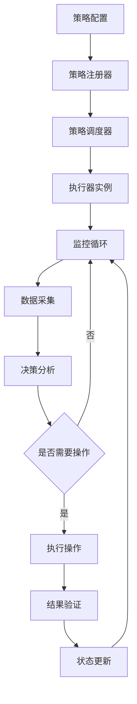
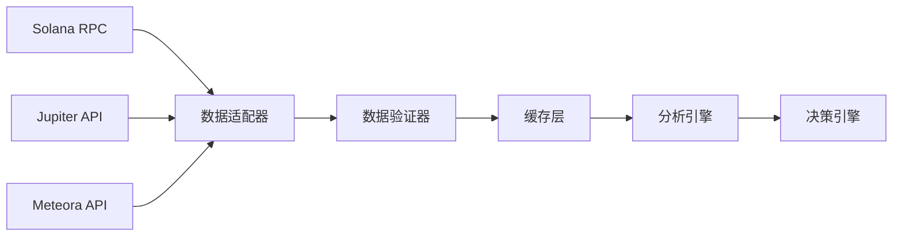
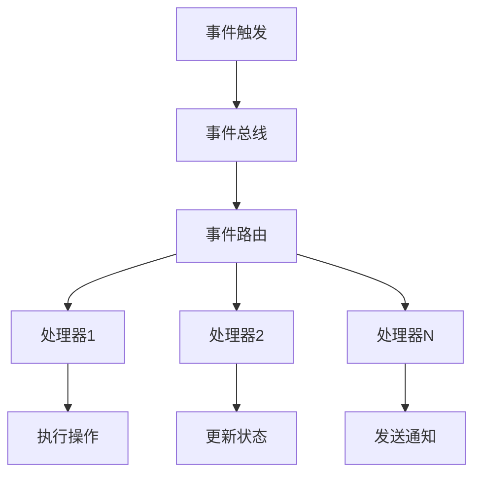

# DLMM流动性管理系统架构复刻指南

## 📋 系统概述

本文档提供了完整复刻当前DLMM流动性管理系统架构的详细指南，帮助开发团队构建一套全新的、架构优化的系统。

### 🎯 系统核心价值
- **多策略支持**: 支持多种流动性管理策略（连锁头寸、简单Y策略等）
- **实例隔离**: 每个策略实例完全独立，数据不互相影响
- **智能监控**: 实时监控头寸状态、收益分析、风险管理
- **自动化操作**: 智能止损、头寸重建、收益提取等自动化功能
- **高可靠性**: 完整的重试机制、错误恢复、故障转移

## 🏗️ 技术架构设计

### 核心技术栈

```yaml
Backend:
  Runtime: Node.js 18+
  Language: TypeScript 4.9+
  Framework: Express.js
  DI Container: TSyringe
  WebSocket: Socket.IO
  Database: JSON文件存储 + Redis缓存
  Blockchain: Solana Web3.js + Anchor
  Testing: Jest + Supertest

Frontend:
  Runtime: 原生JavaScript (ES6+)
  UI Framework: 原生DOM操作 + CSS Grid/Flexbox
  通信: WebSocket + REST API
  状态管理: 事件驱动模式

External APIs:
  - Jupiter DEX API (代币交换)
  - Meteora DLMM API (流动性管理)
  - Helius RPC (Solana节点)
  - 自定义RPC池 (多节点负载均衡)
```

### 分层架构设计

```
┌─────────────────────────────────────────────────────────┐
│                    🌐 Web界面层                          │
│  • 策略配置界面  • 监控面板  • 数据可视化                 │
└─────────────────────────────────────────────────────────┘
                            ↕️
┌─────────────────────────────────────────────────────────┐
│                    🔗 API网关层                          │
│  • REST API  • WebSocket  • 身份验证  • 限流控制         │
└─────────────────────────────────────────────────────────┘
                            ↕️
┌─────────────────────────────────────────────────────────┐
│                    📋 业务编排层                         │
│  • 策略管理器  • 调度器  • 事件总线  • 工作流引擎        │
└─────────────────────────────────────────────────────────┘
                            ↕️
┌─────────────────────────────────────────────────────────┐
│                    ⚙️ 策略执行层                          │
│  • 连锁头寸执行器  • 简单Y执行器  • 自定义策略执行器      │
└─────────────────────────────────────────────────────────┘
                            ↕️
┌─────────────────────────────────────────────────────────┐
│                    💼 业务服务层                         │
│  • 头寸管理  • 收益分析  • 风险控制  • 智能决策          │
└─────────────────────────────────────────────────────────┘
                            ↕️
┌─────────────────────────────────────────────────────────┐
│                    🔌 外部服务层                         │
│  • Jupiter服务  • Meteora服务  • 钱包服务  • RPC服务     │
└─────────────────────────────────────────────────────────┘
                            ↕️
┌─────────────────────────────────────────────────────────┐
│                    🏗️ 基础设施层                          │
│  • 日志系统  • 配置管理  • 状态管理  • 缓存服务          │
└─────────────────────────────────────────────────────────┘
```

## 📂 目录结构设计

```
dlmm-v2/
├── 📁 config/                          # 配置文件
│   ├── default.json                    # 默认配置
│   ├── production.json                 # 生产环境配置
│   └── development.json                # 开发环境配置
│
├── 📁 src/                             # 源代码
│   ├── 📁 app.ts                       # 应用入口
│   │
│   ├── 📁 api/                         # API层
│   │   ├── 📁 controllers/             # 控制器
│   │   ├── 📁 middleware/              # 中间件
│   │   ├── 📁 routes/                  # 路由定义
│   │   └── 📁 validators/              # 请求验证
│   │
│   ├── 📁 core/                        # 核心业务层
│   │   ├── 📁 strategy/                # 策略相关
│   │   │   ├── 📁 executors/           # 执行器
│   │   │   ├── 📁 registry/            # 策略注册
│   │   │   ├── 📁 scheduler/           # 调度器
│   │   │   └── 📁 storage/             # 存储
│   │   │
│   │   ├── 📁 analytics/               # 分析模块
│   │   │   ├── 📁 yield/               # 收益分析
│   │   │   ├── 📁 risk/                # 风险分析
│   │   │   └── 📁 performance/         # 性能分析
│   │   │
│   │   ├── 📁 monitoring/              # 监控模块
│   │   │   ├── 📁 health/              # 健康检查
│   │   │   ├── 📁 metrics/             # 指标收集
│   │   │   └── 📁 alerts/              # 告警系统
│   │   │
│   │   └── 📁 automation/              # 自动化模块
│   │       ├── 📁 stop-loss/           # 止损模块
│   │       ├── 📁 rebalance/           # 重平衡模块
│   │       └── 📁 harvest/             # 收益提取模块
│   │
│   ├── 📁 services/                    # 服务层
│   │   ├── 📁 blockchain/              # 区块链服务
│   │   │   ├── SolanaService.ts        # Solana基础服务
│   │   │   ├── WalletService.ts        # 钱包管理
│   │   │   └── TransactionService.ts   # 交易管理
│   │   │
│   │   ├── 📁 external/                # 外部API服务
│   │   │   ├── JupiterService.ts       # Jupiter DEX
│   │   │   ├── MeteoraService.ts       # Meteora DLMM
│   │   │   └── HeliusService.ts        # Helius RPC
│   │   │
│   │   ├── 📁 position/                # 头寸管理服务
│   │   │   ├── PositionManager.ts      # 头寸管理器
│   │   │   ├── PositionTracker.ts      # 头寸跟踪
│   │   │   └── PositionAnalyzer.ts     # 头寸分析
│   │   │
│   │   └── 📁 data/                    # 数据服务
│   │       ├── CacheService.ts         # 缓存服务
│   │       ├── StateService.ts         # 状态管理
│   │       └── StorageService.ts       # 存储服务
│   │
│   ├── 📁 infrastructure/              # 基础设施
│   │   ├── 📁 logging/                 # 日志系统
│   │   │   ├── LoggerService.ts        # 日志服务
│   │   │   ├── LogWriter.ts            # 日志写入器
│   │   │   └── LogRotator.ts           # 日志轮转
│   │   │
│   │   ├── 📁 config/                  # 配置管理
│   │   │   ├── ConfigService.ts        # 配置服务
│   │   │   └── EnvironmentService.ts   # 环境管理
│   │   │
│   │   ├── 📁 events/                  # 事件系统
│   │   │   ├── EventBus.ts             # 事件总线
│   │   │   └── EventHandlers.ts        # 事件处理器
│   │   │
│   │   └── 📁 reliability/             # 可靠性保障
│   │       ├── RetryManager.ts         # 重试管理器
│   │       ├── CircuitBreaker.ts       # 熔断器
│   │       └── HealthChecker.ts        # 健康检查
│   │
│   ├── 📁 types/                       # 类型定义
│   │   ├── interfaces.ts               # 接口定义
│   │   ├── enums.ts                    # 枚举定义
│   │   └── models.ts                   # 数据模型
│   │
│   └── 📁 utils/                       # 工具库
│       ├── crypto.ts                   # 加密工具
│       ├── math.ts                     # 数学工具
│       ├── time.ts                     # 时间工具
│       └── validation.ts               # 验证工具
│
├── 📁 web/                             # Web前端
│   ├── 📁 public/                      # 静态资源
│   │   ├── 📁 css/                     # 样式文件
│   │   ├── 📁 js/                      # JavaScript文件
│   │   │   ├── 📁 core/                # 核心模块
│   │   │   ├── 📁 components/          # UI组件
│   │   │   ├── 📁 services/            # 前端服务
│   │   │   └── 📁 utils/               # 工具函数
│   │   └── 📁 assets/                  # 资源文件
│   └── server.js                       # 静态服务器
│
├── 📁 tests/                           # 测试代码
│   ├── 📁 unit/                        # 单元测试
│   ├── 📁 integration/                 # 集成测试
│   ├── 📁 e2e/                         # 端到端测试
│   └── 📁 fixtures/                    # 测试夹具
│
├── 📁 scripts/                         # 脚本文件
│   ├── build.sh                        # 构建脚本
│   ├── deploy.sh                       # 部署脚本
│   └── backup.sh                       # 备份脚本
│
├── 📁 docs/                            # 文档
│   ├── API.md                          # API文档
│   ├── DEPLOYMENT.md                   # 部署文档
│   └── DEVELOPMENT.md                  # 开发文档
│
├── 📁 data/                            # 数据目录
│   ├── 📁 strategies/                  # 策略数据
│   ├── 📁 cache/                       # 缓存数据
│   └── 📁 logs/                        # 日志文件
│
├── package.json                        # 依赖管理
├── tsconfig.json                       # TypeScript配置
├── docker-compose.yml                  # Docker编排
└── README.md                           # 项目说明
```

## 🔧 核心模块设计

### 1. 策略执行引擎

```typescript
// 策略执行器基类
export abstract class BaseStrategyExecutor {
    abstract async initialize(config: StrategyConfig): Promise<void>;
    abstract async start(): Promise<void>;
    abstract async stop(): Promise<void>;
    abstract async cleanup(): Promise<void>;
    abstract getStatus(): ExecutorStatus;
}

// 策略注册器
export class StrategyRegistry {
    private strategies = new Map<string, StrategyFactory>();
    
    register<T extends BaseStrategyExecutor>(
        type: string, 
        factory: StrategyFactory<T>
    ): void;
    
    create<T extends BaseStrategyExecutor>(
        type: string, 
        config: StrategyConfig
    ): T;
}

// 策略调度器
export class StrategyScheduler {
    private instances = new Map<string, ScheduledStrategy>();
    
    async schedule(strategy: StrategyInstance): Promise<void>;
    async unschedule(instanceId: string): Promise<void>;
    async reschedule(instanceId: string): Promise<void>;
}
```

### 2. 实例隔离架构

```typescript
// 服务工厂模式 - 实现实例级数据隔离
export class ServiceFactory {
    private instances = new Map<string, ServiceContainer>();
    
    createServices(instanceId: string): ServiceContainer {
        const container = {
            analytics: new AnalyticsService(instanceId),
            monitor: new MonitorService(instanceId),
            trader: new TradingService(instanceId),
            logger: new InstanceLogger(instanceId)
        };
        
        this.instances.set(instanceId, container);
        return container;
    }
    
    getServices(instanceId: string): ServiceContainer | null {
        return this.instances.get(instanceId) || null;
    }
    
    cleanupServices(instanceId: string): void {
        const container = this.instances.get(instanceId);
        if (container) {
            container.cleanup();
            this.instances.delete(instanceId);
        }
    }
}
```

### 3. 可靠性保障系统

```typescript
// 重试管理器
export class RetryManager {
    private configs = new Map<string, RetryConfig>();
    
    async executeWithRetry<T>(
        operation: () => Promise<T>,
        type: string,
        context: string
    ): Promise<T> {
        const config = this.configs.get(type);
        let lastError: Error;
        
        for (let attempt = 1; attempt <= config.maxAttempts; attempt++) {
            try {
                return await operation();
            } catch (error) {
                lastError = error;
                
                if (attempt < config.maxAttempts && this.isRetryable(error, config)) {
                    await this.delay(config.delayMs * attempt);
                    continue;
                }
                break;
            }
        }
        
        throw lastError;
    }
}

// 熔断器
export class CircuitBreaker {
    private state: 'CLOSED' | 'OPEN' | 'HALF_OPEN' = 'CLOSED';
    private failures = 0;
    private lastFailureTime = 0;
    
    async execute<T>(operation: () => Promise<T>): Promise<T> {
        if (this.state === 'OPEN') {
            if (Date.now() - this.lastFailureTime > this.timeout) {
                this.state = 'HALF_OPEN';
            } else {
                throw new Error('Circuit breaker is OPEN');
            }
        }
        
        try {
            const result = await operation();
            this.onSuccess();
            return result;
        } catch (error) {
            this.onFailure();
            throw error;
        }
    }
}
```

### 4. 事件驱动架构

```typescript
// 事件总线
export class EventBus {
    private handlers = new Map<string, EventHandler[]>();
    
    subscribe<T>(event: string, handler: EventHandler<T>): void {
        const handlers = this.handlers.get(event) || [];
        handlers.push(handler);
        this.handlers.set(event, handlers);
    }
    
    async publish<T>(event: string, data: T): Promise<void> {
        const handlers = this.handlers.get(event) || [];
        await Promise.all(
            handlers.map(handler => handler(data))
        );
    }
}

// 事件定义
export interface StrategyEvents {
    'strategy.started': StrategyStartedEvent;
    'strategy.stopped': StrategyStoppedEvent;
    'position.created': PositionCreatedEvent;
    'position.closed': PositionClosedEvent;
    'stop.loss.triggered': StopLossTriggeredEvent;
    'yield.harvested': YieldHarvestedEvent;
}
```

### 5. 监控与分析系统

```typescript
// 性能监控
export class PerformanceMonitor {
    private metrics = new Map<string, Metric[]>();
    
    record(name: string, value: number, tags?: Record<string, string>): void {
        const metric = {
            name,
            value,
            timestamp: Date.now(),
            tags: tags || {}
        };
        
        const metrics = this.metrics.get(name) || [];
        metrics.push(metric);
        this.metrics.set(name, metrics);
    }
    
    getMetrics(name: string, timeRange?: TimeRange): Metric[] {
        const metrics = this.metrics.get(name) || [];
        
        if (timeRange) {
            return metrics.filter(m => 
                m.timestamp >= timeRange.start && 
                m.timestamp <= timeRange.end
            );
        }
        
        return metrics;
    }
}

// 收益分析器
export class YieldAnalyzer {
    calculateYield(positions: Position[], timeRange: TimeRange): YieldReport {
        const totalInvested = positions.reduce((sum, p) => sum + p.invested, 0);
        const currentValue = positions.reduce((sum, p) => sum + p.currentValue, 0);
        
        return {
            totalInvested,
            currentValue,
            absoluteReturn: currentValue - totalInvested,
            percentageReturn: ((currentValue - totalInvested) / totalInvested) * 100,
            timeWeightedReturn: this.calculateTWR(positions, timeRange),
            sharpeRatio: this.calculateSharpeRatio(positions, timeRange)
        };
    }
}
```

## 🔄 数据流设计

### 1. 策略执行流



### 2. 数据采集流



### 3. 事件处理流



## 🛠️ 开发实施计划

### Phase 1: 基础架构 (2-3周)
1. **项目初始化**
   - 设置TypeScript + Node.js环境
   - 配置依赖注入容器
   - 建立基础目录结构

2. **核心基础设施**
   - 实现日志系统
   - 实现配置管理
   - 实现状态管理
   - 实现事件总线

3. **可靠性模块**
   - 实现重试管理器
   - 实现熔断器
   - 实现健康检查器

### Phase 2: 服务层 (3-4周)
1. **区块链服务**
   - Solana连接管理
   - 钱包服务
   - 交易服务

2. **外部API服务**
   - Jupiter集成
   - Meteora集成
   - Helius集成

3. **数据服务**
   - 缓存服务
   - 存储服务
   - 数据同步服务

### Phase 3: 业务核心 (4-5周)
1. **策略引擎**
   - 策略注册器
   - 策略调度器
   - 执行器基类

2. **分析模块**
   - 收益分析器
   - 风险分析器
   - 性能监控器

3. **自动化模块**
   - 止损模块
   - 重平衡模块
   - 收益提取模块

### Phase 4: 策略实现 (3-4周)
1. **连锁头寸策略**
   - 执行器实现
   - 监控逻辑
   - 决策算法

2. **简单Y策略**
   - 执行器实现
   - 收益计算
   - 自动化逻辑

3. **策略扩展框架**
   - 插件化架构
   - 自定义策略支持

### Phase 5: API与前端 (2-3周)
1. **REST API**
   - 控制器实现
   - 中间件配置
   - API文档

2. **WebSocket通信**
   - 实时数据推送
   - 事件广播

3. **Web界面**
   - 策略配置界面
   - 监控面板
   - 数据可视化

### Phase 6: 测试与优化 (2-3周)
1. **测试覆盖**
   - 单元测试
   - 集成测试
   - 端到端测试

2. **性能优化**
   - 内存优化
   - 并发优化
   - 缓存优化

3. **安全加固**
   - 输入验证
   - 权限控制
   - 加密存储

## 📋 关键设计原则

### 1. 模块化设计
- 每个模块职责单一
- 模块间低耦合高内聚
- 支持热插拔和独立部署

### 2. 可扩展性
- 策略插件化架构
- 支持水平扩展
- 配置驱动的功能开关

### 3. 可靠性
- 多层重试机制
- 优雅降级处理
- 故障隔离设计

### 4. 可观测性
- 全链路日志跟踪
- 详细的性能指标
- 实时监控告警

### 5. 安全性
- 最小权限原则
- 数据加密存储
- 安全的API设计

## 🚀 部署架构

### 开发环境
```yaml
Services:
  - Node.js应用 (开发模式)
  - Redis (缓存)
  - 文件存储 (数据持久化)
  
Monitoring:
  - 本地日志文件
  - 控制台输出
```

### 生产环境
```yaml
Load Balancer:
  - Nginx (反向代理 + 负载均衡)

Application Tier:
  - Node.js应用集群 (多实例)
  - PM2进程管理
  - Docker容器化

Data Tier:
  - Redis集群 (缓存)
  - 分布式文件存储
  - 数据库备份

Monitoring:
  - ELK Stack (日志收集)
  - Prometheus + Grafana (指标监控)
  - 告警系统
```

## 📚 技术选型对比

### 依赖注入框架
- **TSyringe** ✅ (轻量级，装饰器支持)
- InversifyJS (功能丰富，但较重)
- TypeDI (中等复杂度)

### 日志系统
- **Winston** ✅ (功能全面，生态丰富)
- Pino (高性能)
- Bunyan (结构化日志)

### 缓存方案
- **Redis** ✅ (功能全面，高性能)
- Memcached (简单高效)
- Node-cache (内存缓存)

### 测试框架
- **Jest** ✅ (功能全面，TypeScript友好)
- Mocha + Chai (灵活配置)
- Vitest (现代化，快速)

## 🎯 核心优化点

### 1. 性能优化
- 连接池管理
- 缓存策略优化
- 异步操作优化
- 内存使用优化

### 2. 可靠性提升
- 多级重试策略
- 熔断器保护
- 故障快速恢复
- 数据一致性保障

### 3. 开发效率
- 热重载开发
- 自动化测试
- 代码生成工具
- 开发文档完善

### 4. 运维友好
- 健康检查接口
- 指标监控完善
- 日志结构化
- 配置热更新

## 📖 迁移策略

### 数据迁移
1. **配置数据**: JSON格式保持兼容
2. **策略数据**: 增加版本字段，支持渐进式迁移
3. **日志数据**: 新格式向下兼容

### 功能迁移
1. **核心功能**: 1:1完整复制
2. **增强功能**: 基于现有功能扩展
3. **新增功能**: 插件化方式添加

### 部署策略
1. **并行部署**: 新旧系统同时运行
2. **灰度切换**: 逐步迁移策略实例
3. **回滚方案**: 保留快速回滚能力

这个架构设计文档提供了完整的系统重构指南，可以帮助你构建一个更加现代化、可维护、可扩展的DLMM流动性管理系统。 