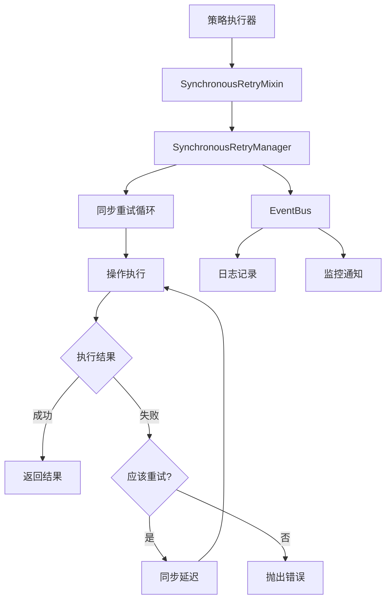

# 🔄 同步事件驱动重试机制集成指南

## 🎯 设计理念

**同步执行 + 事件通知** 的架构设计：

1. **完全同步执行**：重试逻辑在同一个执行上下文中完成，保证状态一致性
2. **事件用于通知**：通过EventBus发布重试事件，用于监控和日志，不用于控制流
3. **立即重试**：失败后立即重试，不破坏执行上下文
4. **模块化设计**：通过混入器简化集成，保持代码分离

## 🏗️ 架构概览



## 🔧 核心组件

### 1. SynchronousRetryManager

```typescript
// 核心特点：
// ✅ 完全同步执行
// ✅ 事件用于通知，不用于控制流
// ✅ 支持配置化重试策略
// ✅ 阻塞式延迟保持执行上下文

class SynchronousRetryManager {
    executeWithRetry<T>(
        operation: SyncRetryableOperation<T>,
        operationType: string,
        instanceId: string,
        customConfig?: Partial<SyncRetryConfig>
    ): T
}
```

### 2. SynchronousRetryMixin

```typescript
// 为策略执行器提供简洁接口：
// ✅ 头寸关闭重试
// ✅ 头寸创建重试  
// ✅ 超出范围处理重试
// ✅ 通用操作重试

class SynchronousRetryMixin {
    protected executeClosePositionWithRetry<T>()
    protected executeCreatePositionWithRetry<T>()
    protected executeOutOfRangeHandlerWithRetry<T>()
}
```

## 📝 集成步骤

### 步骤1：继承重试混入器

```typescript
// ChainPositionExecutor.ts
import { SynchronousRetryMixin } from './mixins/SynchronousRetryMixin';

export class ChainPositionExecutor extends SynchronousRetryMixin {
    // 现有代码保持不变
}
```

### 步骤2：包装需要重试的操作

**原始代码（容易出错）：**
```typescript
// ❌ 直接调用，没有重试机制
async handleOutOfRange(state: StrategyState): Promise<StrategyResult> {
    try {
        // 关闭头寸1
        const closeResult1 = await this.positionManager.closePosition(state.positions.yPosition);
        
        // 关闭头寸2  
        const closeResult2 = await this.positionManager.closePosition(state.positions.xPosition);
        
        if (!closeResult1.success || !closeResult2.success) {
            throw new Error('头寸关闭失败');
        }
        
        return { success: true, message: '超出范围处理完成' };
    } catch (error) {
        return { success: false, message: '超出范围处理失败', error: error.message };
    }
}
```

**修改后（带重试机制）：**
```typescript
// ✅ 使用同步重试机制
async handleOutOfRange(state: StrategyState): Promise<StrategyResult> {
    try {
        // 🔄 执行带重试的超出范围处理
        const result = this.executeOutOfRangeHandlerWithRetry(
            () => {
                // 同步执行关闭操作
                const closeResult1 = this.positionManager.closePosition(state.positions.yPosition);
                const closeResult2 = this.positionManager.closePosition(state.positions.xPosition);
                
                if (!closeResult1.success || !closeResult2.success) {
                    throw new Error('头寸关闭失败');
                }
                
                return { closeResult1, closeResult2 };
            },
            state.instanceId
        );
        
        return { success: true, message: '超出范围处理完成', data: result };
    } catch (error) {
        return { success: false, message: '超出范围处理失败', error: error.message };
    }
}
```

### 步骤3：自定义重试配置（可选）

```typescript
// 为特定操作定制重试策略
const customRetryConfig = {
    maxAttempts: 5,                    // 最大重试5次
    retryableErrors: ['RPC_ERROR'],    // 只重试RPC错误
    delayMs: 5000                      // 重试间隔5秒
};

const result = this.executeClosePositionWithRetry(
    () => this.positionManager.closePosition(positionAddress),
    state.instanceId,
    customRetryConfig  // 自定义配置
);
```

## 🎯 实际使用示例

### 示例1：头寸关闭重试

```typescript
private async closePositionWithRetry(positionAddress: string, instanceId: string) {
    return this.executeClosePositionWithRetry(
        () => {
            // 同步执行关闭操作
            const result = this.positionManager.closePosition(positionAddress);
            
            // 可选的结果验证
            if (!result.success) {
                throw new Error(`头寸关闭失败: ${result.error}`);
            }
            
            return result;
        },
        instanceId
    );
}
```

### 示例2：批量操作重试

```typescript
private async closeBatchPositionsWithRetry(positions: string[], instanceId: string) {
    return this.executeOutOfRangeHandlerWithRetry(
        () => {
            const results = [];
            for (const position of positions) {
                const result = this.positionManager.closePosition(position);
                if (!result.success) {
                    throw new Error(`批量关闭失败，位置: ${position}`);
                }
                results.push(result);
            }
            return results;
        },
        instanceId
    );
}
```

### 示例3：带结果验证的重试

```typescript
private async createPositionWithValidation(params: any, instanceId: string) {
    return this.executeWithRetryAndValidation(
        () => {
            const result = this.positionManager.createPosition(params);
            return result;
        },
        (result) => {
            // 验证结果是否符合预期
            return result.success && result.positionAddress !== null;
        },
        'position.create',
        instanceId
    );
}
```

## 📊 重试事件监听

```typescript
// 在策略执行器中监听重试事件
this.eventBus.subscribe('sync.retry.started', (event) => {
    this.loggerService.logSystem('INFO', 
        `🔄 开始重试操作: ${event.data.operationType} (${event.data.instanceId})`
    );
});

this.eventBus.subscribe('sync.retry.success', (event) => {
    this.loggerService.logSystem('INFO', 
        `✅ 重试操作成功: ${event.data.operationName} (第${event.data.totalAttempts}次尝试)`
    );
});

this.eventBus.subscribe('sync.retry.failed', (event) => {
    this.loggerService.logSystem('ERROR', 
        `🚨 重试操作最终失败: ${event.data.operationName} (${event.data.totalAttempts}次尝试)`
    );
});
```

## 🔧 默认重试配置

```typescript
// 系统预设的重试配置
const defaultConfigs = {
    'position.close': {
        maxAttempts: 3,
        retryableErrors: ['交易验证超时', '交易失败', 'RPC_ERROR', 'NETWORK_ERROR'],
        delayMs: 1000
    },
    'position.create': {
        maxAttempts: 2,
        retryableErrors: ['交易验证超时', '余额不足', 'SLIPPAGE_ERROR'],
        delayMs: 2000
    },
    'outOfRange.handler': {
        maxAttempts: 3,
        retryableErrors: ['交易验证超时', '交易失败', 'RPC_ERROR'],
        delayMs: 3000
    }
};
```

## ⚠️ 重要注意事项

### 1. 状态一致性保证
- ✅ **同步执行**：重试在同一个执行上下文中完成
- ✅ **原子操作**：要么全部成功，要么全部失败
- ✅ **状态不变**：重试过程中策略状态不会被其他操作修改

### 2. 错误处理策略
- ✅ **可重试错误**：网络超时、RPC错误、交易验证失败
- ❌ **不可重试错误**：参数错误、权限不足、余额不足（某些情况）
- ✅ **智能判断**：根据错误类型决定是否重试

### 3. 性能考虑
- ⚡ **阻塞式延迟**：使用`while`循环实现同步延迟
- ⚡ **适度重试**：避免过度重试导致系统负载过高
- ⚡ **快速失败**：对于明显不可重试的错误立即失败

## 🚀 迁移建议

### 现有代码迁移步骤：

1. **识别需要重试的操作**
   - 头寸关闭操作
   - 头寸创建操作  
   - 超出范围处理

2. **继承重试混入器**
   ```typescript
   export class YourExecutor extends SynchronousRetryMixin {
   ```

3. **包装关键操作**
   ```typescript
   // 原始调用
   const result = await this.someOperation();
   
   // 重试包装
   const result = this.executeWithRetry(
       () => this.someOperation(),
       'operation.type',
       instanceId
   );
   ```

4. **测试验证**
   - 正常情况测试
   - 失败重试测试
   - 重试耗尽测试

## 🎉 总结

同步事件驱动重试机制的优势：

- 🔒 **状态一致性**：完全同步执行，避免状态竞争
- 🎯 **简单易用**：通过混入器提供简洁接口
- 📊 **完整监控**：通过事件系统提供详细的重试信息
- 🔧 **高度可配置**：支持自定义重试策略
- 🏗️ **模块化设计**：保持代码分离，易于维护

这种设计完美符合你的要求：**同步执行保证状态一致性，事件驱动提供监控能力，模块化设计保持架构合理**。 