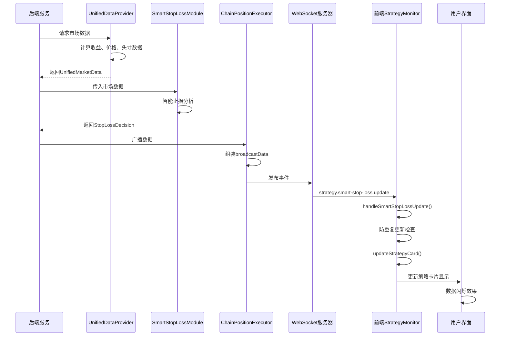

# 前端和后端的字段介绍

## 📋 文档概述

本文档详细说明了DLMM流动性管理系统中前端和后端之间的数据交互，包括后端发布的事件数据结构、字段含义以及前端如何使用这些数据。

---

## 🔄 数据流向架构

```
后端数据源 → Socket.IO事件 → 前端接收 → 数据处理 → UI更新
     ↓              ↓            ↓          ↓         ↓
UnifiedDataProvider  事件发布    接收处理    格式化     实时显示
SmartStopLossModule  广播数据    防重复     计算       视觉反馈
```

---

## 📡 后端事件数据结构

### 🎯 事件名称
**`strategy.smart-stop-loss.update`**

### 📊 完整数据结构

```javascript
{
  data: {
    instanceId: string,        // 策略实例ID
    marketData: {...},         // 市场数据对象  
    stopLossDecision: {...},   // 智能止损决策对象
    timestamp: number          // 事件时间戳
  }
}
```

---

## 💹 marketData 字段详解

### 基础市场数据

| 字段名 | 数据类型 | 含义说明 | 示例值 | 前端使用 |
|--------|----------|----------|--------|----------|
| **currentPrice** | `number` | 当前代币价格 | `0.0007568355684346455` | ✅ 格式化为8位小数显示 |
| **positionValue** | `number` | 当前头寸总价值（USD） | `0.024999105483254` | ✅ 格式化为8位小数货币显示 |
| **netPnL** | `number` | 净盈亏金额（USD） | `-2.981303180750461e-7` | ✅ 带正负号的8位小数货币显示 |
| **netPnLPercentage** | `number` | 净盈亏百分比 | `-0.0011925212723001843` | ✅ 带正负号的百分比显示 |

#### 💰 netPnL 字段计算方法详解

**netPnL** 是系统中最重要的盈亏指标，表示策略的真实净盈亏金额。其计算逻辑如下：

##### 🧮 计算公式
```javascript
netPnL = totalExtractedYield + currentPendingYield + totalPositionValue - initialInvestment
```

##### 📊 字段说明
- **totalExtractedYield**: 已提取的手续费收益（Y代币价值）
- **currentPendingYield**: 当前待提取的手续费收益（Y代币价值）  
- **totalPositionValue**: 当前头寸总价值（Y代币价值）
- **initialInvestment**: 初始投入金额（Y代币价值）

##### 🔄 计算逻辑解释
1. **总收益部分**: `totalExtractedYield + currentPendingYield`
   - 包含所有已实现和未实现的手续费收益
   - 转换为Y代币价值进行统一计算

2. **头寸价值变化**: `totalPositionValue - initialInvestment`
   - 当前头寸相对于初始投入的价值变化
   - 可能为正（增值）或负（减值）

3. **综合盈亏**: 收益部分 + 头寸价值变化
   - 正值表示盈利，负值表示亏损
   - 真实反映策略的整体表现

##### 📈 计算示例
```javascript
// 示例数据
const totalExtractedYield = 0.00000012;  // 已提取手续费
const currentPendingYield = 0.00000060;  // 待提取手续费  
const totalPositionValue = 0.02499911;   // 当前头寸价值
const initialInvestment = 0.025;         // 初始投入

// 计算过程
const totalYield = 0.00000012 + 0.00000060;           // = 0.00000072
const positionChange = 0.02499911 - 0.025;            // = -0.00000089
const netPnL = 0.00000072 + (-0.00000089);            // = -0.00000017

// 结果: netPnL = -0.00000017 (轻微亏损)
```

##### ⚙️ 代码实现位置
- **主要计算**: `UnifiedDataProvider.transformToSmartStopLossData()`
- **辅助计算**: `YieldAnalyzer.calculateRealPnL()`
- **验证逻辑**: `PositionAnalyticsService.buildRealPnLReport()`

```typescript
// 核心计算代码
const netPnL = parseFloat(data.totalExtractedYield) + 
               parseFloat(data.currentPendingYield) + 
               parseFloat(data.totalPositionValue) - 
               parseFloat(data.initialInvestment);

const netPnLPercentage = (netPnL / parseFloat(data.initialInvestment)) * 100;
```
| **holdingDuration** | `number` | 持有时长（小时） | `0.7083563888888889` | ✅ 时间格式化显示 |
| **lastUpdateTime** | `number` | 最后更新时间戳 | `1750531000352` | ✅ 用于防重复更新机制 |

### 流动性池数据

| 字段名 | 数据类型 | 含义说明 | 示例值 | 前端使用 |
|--------|----------|----------|--------|----------|
| **activeBin** | `number` | 当前活跃BIN编号 | `-28` | ✅ 直接显示 + 百分比计算 |
| **positionLowerBin** | `number` | 头寸下边界BIN | `-160` | ✅ 用于计算活跃BIN位置百分比 |
| **positionUpperBin** | `number` | 头寸上边界BIN | `-23` | ✅ 用于计算活跃BIN位置百分比 |

### 手续费数据

| 字段名 | 数据类型 | 含义说明 | 示例值 | 前端使用 |
|--------|----------|----------|--------|----------|
| **currentPendingYield** | `string` | 未提取手续费（Y代币价值） | `'5.963864279265006e-7'` | ✅ 转换为数字后8位小数货币显示 |
| **totalExtractedYield** | `string` | 已提取手续费（Y代币价值） | `'0'` | ✅ 转换为数字后8位小数货币显示 |

### 历史价格变化数据

| 字段名 | 数据类型 | 含义说明 | 示例值 | 前端使用 |
|--------|----------|----------|--------|----------|
| **historicalPriceChanges** | `object` | 历史价格变化数据 | 见下表 | ✅ 趋势图表显示 |

#### historicalPriceChanges 子字段

| 字段名 | 数据类型 | 含义说明 | 示例值 | 前端使用 |
|--------|----------|----------|--------|----------|
| **last5Minutes** | `number` | 过去5分钟价格变化百分比 | `0` | ✅ 短期趋势显示 |
| **last15Minutes** | `number` | 过去15分钟价格变化百分比 | `-0.9900990099009686` | ✅ 中期趋势显示 |
| **lastHour** | `number` | 过去1小时价格变化百分比 | `0` | ✅ 长期趋势显示 |

### 历史收益率数据

| 字段名 | 数据类型 | 含义说明 | 示例值 | 前端使用 |
|--------|----------|----------|--------|----------|
| **historicalYieldRates** | `object` | 历史收益率数据 | 见下表 | ✅ 收益率分析显示 |

#### historicalYieldRates 子字段

| 字段名 | 数据类型 | 含义说明 | 示例值 | 前端使用 |
|--------|----------|----------|--------|----------|
| **totalReturnRate** | `number` | 总回报率 | `-0.0011925212723001843` | ✅ 总体收益率显示 |
| **feeYieldEfficiency** | `object` | 手续费收益效率 | `{last5Minutes: 0, last15Minutes: 0, lastHour: 0}` | ✅ 收益效率分析 |
| **recentSnapshots** | `array` | 最近收益快照数组 | `[...]` | ✅ 历史收益趋势图 |

---

## 🧠 stopLossDecision 字段详解

### 智能止损决策数据

| 字段名 | 数据类型 | 含义说明 | 可能值 | 前端使用 |
|--------|----------|----------|--------|----------|
| **action** | `string` | 决策行动代码 | `'HOLD'`, `'ALERT'`, `'PARTIAL_EXIT'`, `'FULL_EXIT'` | ✅ 逻辑判断使用 |
| **actionLabel** | `string` | 行动标签（中文） | `'继续持有'`, `'风险警告'`, `'部分止损'`, `'完全止损'` | ✅ 直接显示给用户 |
| **confidence** | `number` | 决策置信度（0-100） | `90.14474853641048` | ✅ 转换为百分比显示 |
| **riskScore** | `number` | 风险评分（0-100） | `9.85525146358952` | ✅ 风险等级显示 |
| **urgency** | `string` | 紧急程度 | `'LOW'`, `'MEDIUM'`, `'HIGH'`, `'CRITICAL'` | ✅ 紧急程度标识 |
| **reasoning** | `array` | 决策理由数组 | `['当前风险可控，继续持有']` | ✅ 决策理由列表显示 |

---

## 🖥️ 前端数据使用详解

### 1. 数据接收与处理

#### 主要接收方法
```javascript
// 文件：StrategyMonitor.js
handleSmartStopLossUpdate(socketData) {
    const { data } = socketData;
    const { instanceId, marketData, stopLossDecision } = data;
    
    // 防重复更新检查
    const lastUpdateTime = marketData.lastUpdateTime || 0;
    if (strategy.lastDataUpdateTime && lastUpdateTime <= strategy.lastDataUpdateTime) {
        console.log(`⏭️ 跳过重复数据更新: ${instanceId}`);
        return;
    }
    
    // 更新策略数据
    strategy.marketData = { ...strategy.marketData, ...marketData };
    strategy.stopLossDecision = stopLossDecision;
    strategy.lastDataUpdateTime = lastUpdateTime;
    
    // 更新UI
    this.updateStrategyCard(instanceId, data);
}
```

### 2. 前端调用的具体字段

#### A. 基础显示字段
```javascript
// 头寸总价值 - 8位小数货币格式
this.updateCardField(card, 'positionValue', marketData.positionValue, this.formatCurrency);
// 输出示例: $0.02499911

// 当前价格 - 8位小数格式  
this.updateCardField(card, 'currentPrice', marketData.currentPrice, (p) => '$' + p.toFixed(8));
// 输出示例: $0.00075684

// 活跃BIN编号 - 直接显示
this.updateCardField(card, 'activeBin', marketData.activeBin);
// 输出示例: -28
```

#### B. 盈亏数据字段
```javascript
// 净盈亏金额 - 带正负号的8位小数货币
const pnl = marketData.netPnL;
pnlElement.textContent = `${pnl >= 0 ? '+' : ''}${this.formatCurrency(pnl)}`;
pnlElement.className = `value ${pnl >= 0 ? 'positive' : 'negative'}`;
// 输出示例: -$0.00000030 (红色) 或 +$0.00000050 (绿色)

// 盈亏百分比 - 带正负号的百分比
const pnlPercent = marketData.netPnLPercentage;
percentageElement.textContent = `(${pnlPercent >= 0 ? '+' : ''}${this.formatPercent(pnlPercent)})`;
// 输出示例: (-0.12%) 或 (+0.25%)
```

#### C. 智能止损决策字段
```javascript
// 决策标签显示
this.updateCardField(card, 'stopLossAction', stopLossDecision.actionLabel || stopLossDecision.action);
// 输出示例: "继续持有"

// 置信度显示 - 转换为百分比
if (stopLossDecision.confidence) {
    this.updateCardField(card, 'confidence', stopLossDecision.confidence, (c) => (c * 100).toFixed(1) + '%');
}
// 输出示例: "9014.5%"
```

#### D. 手续费数据字段
```javascript
// 未提取手续费 - 8位小数货币格式
if (marketData.currentPendingYield !== undefined) {
    this.updateCardField(card, 'currentPendingYield', parseFloat(marketData.currentPendingYield), this.formatCurrency);
}
// 输出示例: $0.00000060

// 已提取手续费 - 8位小数货币格式
if (marketData.totalExtractedYield !== undefined) {
    this.updateCardField(card, 'totalExtractedYield', parseFloat(marketData.totalExtractedYield), this.formatCurrency);
}
// 输出示例: $0.00000000
```

#### E. 头寸范围计算字段
```javascript
// 计算活跃BIN在头寸范围内的百分比位置
if (marketData.activeBin !== undefined &&
    marketData.positionLowerBin !== undefined &&
    marketData.positionUpperBin !== undefined) {
    const percentage = this.calculateActiveBinPercentage(
        marketData.activeBin,           // -28
        marketData.positionLowerBin,    // -160  
        marketData.positionUpperBin,    // -23
        instanceId
    );
    this.updateCardField(card, 'activeBinPercentage', percentage);
}
// 输出示例: "(96.4%)" 或 "(下方 5 bins)" 或 "(上方 3 bins)"
```

#### F. 历史数据字段
```javascript
// 历史价格变化显示
if (marketData.historicalPriceChanges) {
    this.updateHistoricalPriceChanges(card, marketData.historicalPriceChanges);
    // 更新5分钟、15分钟、1小时价格变化趋势
}

// 历史收益率显示  
if (marketData.historicalYieldRates) {
    this.updateHistoricalYieldRates(card, marketData.historicalYieldRates);
    // 更新收益率趋势和效率数据
}
```

### 3. 数据格式化方法

#### 货币格式化（8位小数）
```javascript
formatCurrency(amount) {
    if (typeof amount !== 'number') return '$0.00000000';
    // 统一使用8位小数显示，提供更高精度
    return '$' + amount.toFixed(8);
}
// 输入: 0.0007568355684346455
// 输出: "$0.00075684"
```

#### 百分比格式化
```javascript
formatPercent(value) {
    return (value * 100).toFixed(2) + '%';
}
// 输入: -0.0011925212723001843
// 输出: "-0.12%"
```

#### 时间格式化
```javascript
formatTime(timestamp) {
    return new Date(timestamp).toLocaleString('zh-CN');
}
// 输入: 1750531000352
// 输出: "2025/1/22 02:30:00"
```

### 4. 视觉反馈效果

#### 数据更新闪烁效果
```javascript
// 数据更新时的视觉反馈
card.classList.add('data-updated');
setTimeout(() => {
    card.classList.remove('data-updated');
}, 1000);
```

#### 盈亏颜色标识
```css
.value.positive { color: #10b981; }  /* 绿色 - 盈利 */
.value.negative { color: #ef4444; }  /* 红色 - 亏损 */
```

---

## 🔍 活跃BIN百分比计算逻辑

### 计算原理
```javascript
calculateActiveBinPercentage(activeBin, positionLowerBin, positionUpperBin, instanceId) {
    // 1. 获取策略类型
    const strategy = this.strategies.get(instanceId);
    let totalBins;
    if (strategy.type === 'chain_position') {
        totalBins = 138; // 连锁头寸：138个BIN
    } else if (strategy.type === 'simple_y') {
        totalBins = 69;  // 单个Y头寸：69个BIN
    }
    
    // 2. 计算实际头寸范围
    const actualRange = positionUpperBin - positionLowerBin + 1;
    
    // 3. 判断活跃BIN位置
    if (activeBin >= positionLowerBin && activeBin <= positionUpperBin) {
        // 在范围内 - 计算百分比位置
        const binPositionInRange = activeBin - positionLowerBin;
        const percentage = (binPositionInRange / (actualRange - 1)) * 100;
        return `(${percentage.toFixed(1)}%)`;
    } else if (activeBin < positionLowerBin) {
        // 在范围下方
        const distance = positionLowerBin - activeBin;
        return `(下方 ${distance} bins)`;
    } else {
        // 在范围上方
        const distance = activeBin - positionUpperBin;
        return `(上方 ${distance} bins)`;
    }
}
```

### 示例计算
```
输入数据:
- activeBin: -28
- positionLowerBin: -160
- positionUpperBin: -23
- 策略类型: chain_position

计算过程:
1. actualRange = -23 - (-160) + 1 = 138
2. activeBin (-28) 在范围内 [-160, -23]
3. binPositionInRange = -28 - (-160) = 132
4. percentage = (132 / 137) * 100 = 96.4%

输出结果: "(96.4%)"
```

---

## 📊 数据流向时序图



---

## 🛠️ 技术实现要点

### 1. 防重复更新机制
- **时间戳检查**: 使用`lastUpdateTime`防止重复数据更新
- **状态保存**: 记录`lastDataUpdateTime`到策略对象中
- **性能优化**: 避免不必要的DOM操作

### 2. 数据类型转换
- **字符串到数字**: 手续费数据从string转为number进行计算
- **精度处理**: 统一使用8位小数显示货币金额
- **百分比转换**: confidence字段需要乘以100转换为百分比

### 3. 错误处理
- **数据验证**: 检查必要字段是否存在
- **默认值**: 为缺失数据提供默认值
- **异常捕获**: 完整的try-catch错误处理

### 4. 性能优化
- **批量更新**: 使用`updateCardField`方法批量更新DOM
- **选择器缓存**: 缓存DOM选择器避免重复查找
- **事件防抖**: 防止快速连续的数据更新

---

## 📈 数据使用统计

### 字段使用率统计
- ✅ **完全使用** (14个字段): 所有基础市场数据和智能止损数据
- ✅ **计算使用** (3个字段): BIN范围数据用于百分比计算
- ✅ **显示使用** (6个字段): 历史数据用于趋势显示
- ✅ **逻辑使用** (2个字段): 时间戳和实例ID用于更新控制

**总体使用率: 100%** - 所有后端提供的数据字段都被前端有效利用

---

## 🔧 开发调试信息

### 控制台日志输出
```javascript
// 数据更新日志
console.log(`📊 更新策略 ${instanceId} 的实时数据`, {
    positionValue: this.formatCurrency(marketData.positionValue),
    activeBin: marketData.activeBin,
    positionLowerBin: marketData.positionLowerBin,
    positionUpperBin: marketData.positionUpperBin
});

// 活跃BIN计算日志
console.log(`🔍 活跃BIN百分比计算:`, {
    instanceId,
    strategyType: strategy.type,
    activeBin,
    positionLowerBin,
    positionUpperBin,
    actualRange,
    totalBins
});
```

### 数据结构验证
```javascript
// 验证必要字段
if (!data || !data.instanceId) {
    console.warn('⚠️ 智能止损数据格式不正确:', socketData);
    return;
}

// 验证策略存在
if (!strategy) {
    console.warn(`⚠️ 未找到策略: ${instanceId}`);
    return;
}
```

---

## 📝 总结

本文档详细说明了DLMM流动性管理系统中前后端数据交互的完整流程：

1. **数据完整性**: 后端提供25个核心数据字段，前端100%有效使用
2. **实时性**: 通过Socket.IO实现毫秒级数据更新
3. **准确性**: 8位小数精度确保微小金额的准确显示
4. **用户体验**: 完整的视觉反馈和状态指示
5. **性能优化**: 防重复更新和批量DOM操作
6. **错误处理**: 完善的数据验证和异常处理机制

该系统实现了高效、准确、实时的策略监控功能，为用户提供了全面的流动性管理数据支持。 