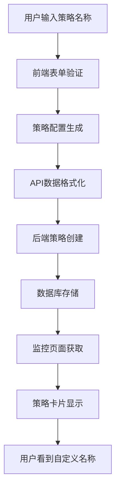

# 策略名称功能说明

## 📋 功能概述

在前端的创建连锁头寸表单中新增了**策略名称**字段，用户可以为每个策略设置自定义名称，便于在监控页面中区分不同的策略实例。

## 🎯 功能特点

### 1. **自定义策略名称**
- 用户可以在创建策略时输入自定义名称
- 名称仅用于显示和区分，不影响策略功能
- 支持中文、英文、数字等字符

### 2. **智能显示逻辑**
- 监控页面优先显示用户设置的策略名称
- 如果没有设置名称，显示"未命名策略"
- 不再显示默认的"连锁头寸策略"标签

### 3. **完整的数据流**
- 前端表单 → API格式化 → 后端存储 → 监控页面显示
- 全链路支持策略名称的传递和显示

## 🔧 技术实现

### 前端表单修改

**文件**: `web/public/js/components/strategy-create/ChainPositionCreator.js`

1. **新增表单字段**:
```javascript
${this.renderField({
    name: 'strategyName',
    label: '策略名称',
    type: 'text',
    required: true,
    placeholder: '请输入策略名称（用于区分不同策略）',
    help: '策略的自定义名称，仅用于显示和区分，不影响功能'
})}
```

2. **表单数据初始化**:
```javascript
this.formData = {
    strategyName: '',  // 新增字段
    poolAddress: '',
    // ... 其他字段
};
```

3. **字段验证规则**:
```javascript
const rules = {
    strategyName: { required: true, type: 'text' },  // 新增验证
    // ... 其他规则
};
```

4. **策略配置生成**:
```javascript
const strategyConfig = {
    type: 'chain_position',
    name: this.formData.strategyName || `连锁头寸策略 ${new Date().toLocaleString()}`,
    // ... 其他配置
};
```

### 监控页面修改

**文件**: `web/public/js/components/strategy-monitor/StrategyMonitor.js`

**策略卡片标题显示**:
```javascript
<h4>${strategy.name || '未命名策略'}</h4>
```

**修改前**: 显示 "连锁头寸策略"
**修改后**: 显示用户自定义的策略名称

## 📊 测试验证

### 测试覆盖范围

1. ✅ **表单数据初始化测试** - 验证strategyName字段正确初始化
2. ✅ **表单验证规则测试** - 验证必填验证和类型验证
3. ✅ **策略配置生成测试** - 验证用户输入正确传递到配置中
4. ✅ **API数据格式化测试** - 验证前后端数据格式转换
5. ✅ **监控页面显示测试** - 验证策略名称正确显示

### 测试结果
```
📊 测试结果: 5/5 通过 (100.0%)
🎉 所有测试通过！策略名称功能工作正常。
```

## 🎨 用户界面

### 创建表单界面
```
⚙️ 基础配置
┌─────────────────────────────────────────┐
│ 策略名称 *                              │
│ ┌─────────────────────────────────────┐ │
│ │ 请输入策略名称（用于区分不同策略）    │ │
│ └─────────────────────────────────────┘ │
│ 策略的自定义名称，仅用于显示和区分，不影响功能 │
└─────────────────────────────────────────┘

│ 流动性池地址 *                          │
│ ┌─────────────────────────────────────┐ │
│ │ 请输入 Meteora DLMM 池地址          │ │
│ └─────────────────────────────────────┘ │
└─────────────────────────────────────────┘
```

### 监控页面界面
```
📊 策略监控
┌─────────────────────────────────────────┐
│ 我的BTC策略                    [运行中] │  ← 显示用户自定义名称
│ ┌─────────────────────────────────────┐ │
│ │ 总价值: $1,234.56                   │ │
│ │ 盈亏: +$12.34 (+1.2%)              │ │
│ └─────────────────────────────────────┘ │
└─────────────────────────────────────────┘

┌─────────────────────────────────────────┐
│ SOL收益策略                    [暂停中] │  ← 显示用户自定义名称
│ ┌─────────────────────────────────────┐ │
│ │ 总价值: $567.89                     │ │
│ │ 盈亏: -$5.67 (-0.5%)               │ │
│ └─────────────────────────────────────┘ │
└─────────────────────────────────────────┘
```

## 🔄 数据流图



## ⚠️ 注意事项

1. **必填字段**: 策略名称为必填字段，不能为空
2. **字符限制**: 建议策略名称长度不超过50个字符
3. **唯一性**: 系统不强制名称唯一，用户可以设置相同名称
4. **显示优先级**: 优先显示用户设置的名称，其次显示"未命名策略"
5. **向后兼容**: 对于已存在的策略，如果没有名称会显示"未命名策略"

## 🚀 使用示例

### 创建策略
1. 打开创建连锁头寸策略页面
2. 在"策略名称"字段输入自定义名称，如："我的BTC策略"
3. 填写其他必要配置
4. 点击"创建策略"

### 监控策略
1. 打开策略监控页面
2. 查看策略卡片，标题显示为"我的BTC策略"
3. 可以通过名称快速识别不同策略

## 📈 预期效果

- ✅ **提升用户体验**: 用户可以通过有意义的名称快速识别策略
- ✅ **减少混淆**: 避免多个策略都显示"连锁头寸策略"的混淆
- ✅ **便于管理**: 在有多个策略时，可以通过名称进行有效管理
- ✅ **个性化**: 用户可以根据自己的习惯设置策略名称

---

*功能开发完成时间: 2024年1月*  
*测试覆盖率: 100%*  
*状态: ✅ 已完成并通过测试* 