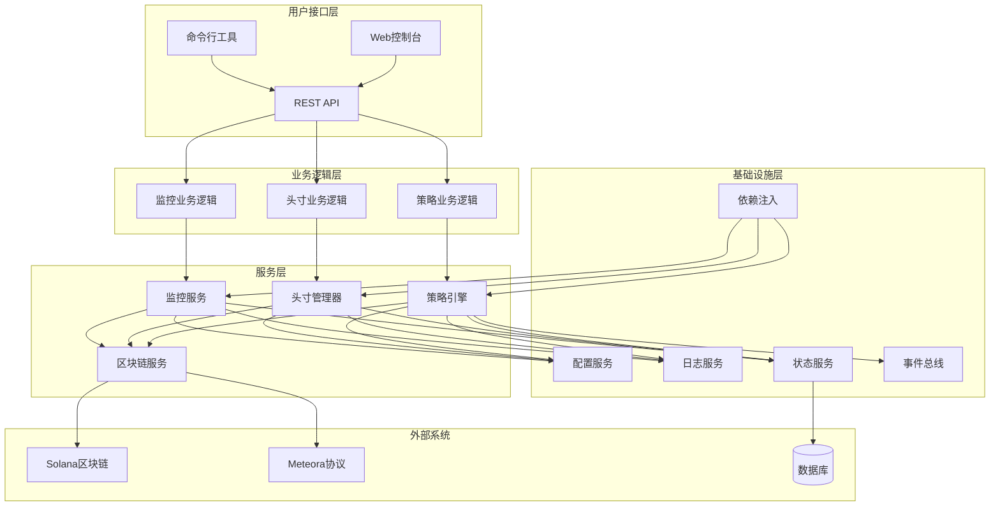
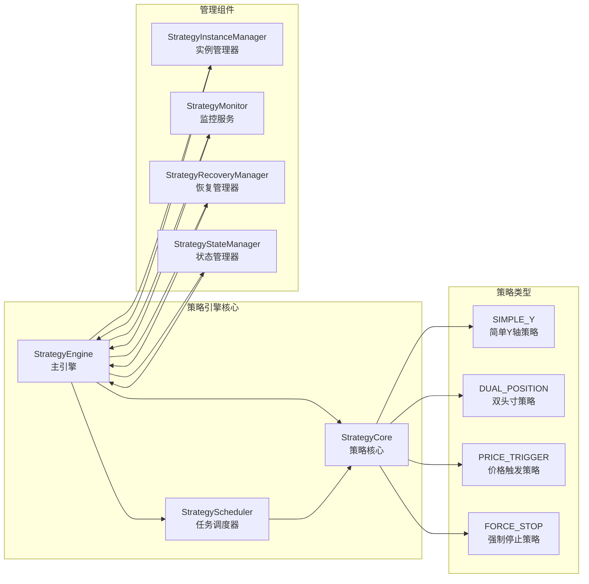
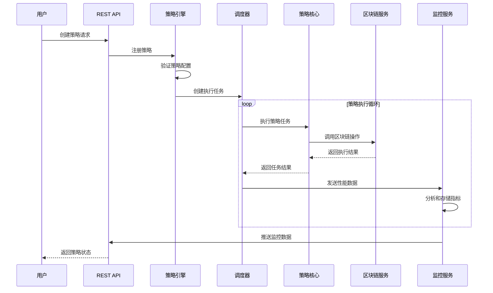
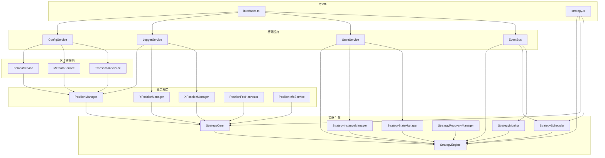
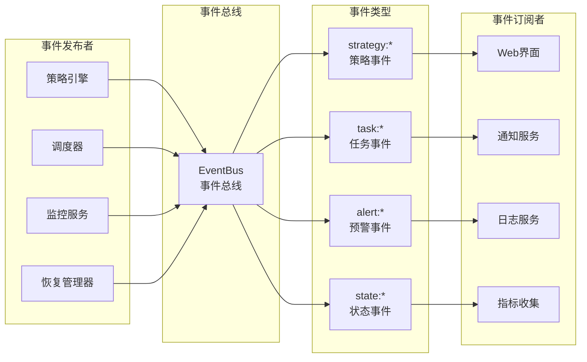
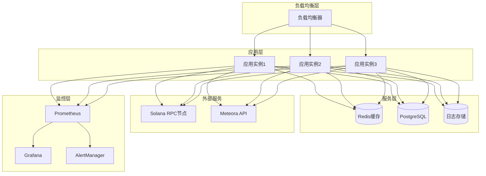

# DLMM流动性管理器 - 系统架构图

## 整体系统架构

```mermaid
graph TB
    subgraph "用户接口层"
        UI[Web控制台]
        API[REST API]
        CLI[命令行工具]
    end
    
    subgraph "业务逻辑层"
        SBL[策略业务逻辑]
        PBL[头寸业务逻辑]
        MBL[监控业务逻辑]
    end
    
    subgraph "服务层"
        SE[策略引擎]
        PM[头寸管理器]
        MON[监控服务]
        BC[区块链服务]
    end
    
    subgraph "基础设施层"
        CONFIG[配置服务]
        LOG[日志服务]
        STATE[状态服务]
        EVENT[事件总线]
        DI[依赖注入]
    end
    
    subgraph "外部系统"
        SOLANA[Solana区块链]
        METEORA[Meteora协议]
        DB[(数据库)]
    end
    
    UI --> API
    CLI --> API
    API --> SBL
    API --> PBL
    API --> MBL
    
    SBL --> SE
    PBL --> PM
    MBL --> MON
    
    SE --> BC
    PM --> BC
    MON --> BC
    
    BC --> SOLANA
    BC --> METEORA
    
    SE --> CONFIG
    SE --> LOG
    SE --> STATE
    SE --> EVENT
    
    PM --> CONFIG
    PM --> LOG
    PM --> STATE
    
    MON --> CONFIG
    MON --> LOG
    MON --> STATE
    
    STATE --> DB
    DI --> SE
    DI --> PM
    DI --> MON
```

## 策略引擎架构

```mermaid
graph LR
    subgraph "策略引擎核心"
        ENGINE[StrategyEngine<br/>主引擎]
        CORE[StrategyCore<br/>策略核心]
        SCHEDULER[StrategyScheduler<br/>任务调度器]
    end
    
    subgraph "管理组件"
        INSTANCE[StrategyInstanceManager<br/>实例管理器]
        MONITOR[StrategyMonitor<br/>监控服务]
        RECOVERY[StrategyRecoveryManager<br/>恢复管理器]
        STATE_MGR[StrategyStateManager<br/>状态管理器]
    end
    
    subgraph "策略类型"
        SIMPLE_Y[SIMPLE_Y<br/>简单Y轴策略]
        DUAL_POS[DUAL_POSITION<br/>双头寸策略]
        PRICE_TRIGGER[PRICE_TRIGGER<br/>价格触发策略]
        FORCE_STOP[FORCE_STOP<br/>强制停止策略]
    end
    
    ENGINE --> CORE
    ENGINE --> SCHEDULER
    ENGINE --> INSTANCE
    ENGINE --> MONITOR
    ENGINE --> RECOVERY
    ENGINE --> STATE_MGR
    
    CORE --> SIMPLE_Y
    CORE --> DUAL_POS
    CORE --> PRICE_TRIGGER
    CORE --> FORCE_STOP
    
    SCHEDULER --> CORE
    INSTANCE --> ENGINE
    MONITOR --> ENGINE
    RECOVERY --> ENGINE
    STATE_MGR --> ENGINE
```

## 数据流架构

```mermaid
sequenceDiagram
    participant USER as 用户
    participant API as REST API
    participant ENGINE as 策略引擎
    participant SCHEDULER as 调度器
    participant CORE as 策略核心
    participant BLOCKCHAIN as 区块链服务
    participant MONITOR as 监控服务
    
    USER->>API: 创建策略请求
    API->>ENGINE: 注册策略
    ENGINE->>ENGINE: 验证策略配置
    ENGINE->>SCHEDULER: 创建执行任务
    
    loop 策略执行循环
        SCHEDULER->>CORE: 执行策略任务
        CORE->>BLOCKCHAIN: 调用区块链操作
        BLOCKCHAIN-->>CORE: 返回执行结果
        CORE-->>SCHEDULER: 返回任务结果
        SCHEDULER->>MONITOR: 发送性能数据
        MONITOR->>MONITOR: 分析和存储指标
    end
    
    MONITOR->>API: 推送监控数据
    API-->>USER: 返回策略状态
```

## 模块依赖关系

```mermaid
graph TD
    subgraph "types"
        INTERFACES[interfaces.ts]
        STRATEGY_TYPES[strategy.ts]
    end
    
    subgraph "基础设施"
        CONFIG_SVC[ConfigService]
        LOGGER_SVC[LoggerService]
        STATE_SVC[StateService]
        EVENT_BUS[EventBus]
    end
    
    subgraph "区块链服务"
        SOLANA_SVC[SolanaService]
        METEORA_SVC[MeteoraService]
        TX_SVC[TransactionService]
    end
    
    subgraph "业务服务"
        POS_MGR[PositionManager]
        Y_POS_MGR[YPositionManager]
        X_POS_MGR[XPositionManager]
        FEE_HARVESTER[PositionFeeHarvester]
        INFO_SVC[PositionInfoService]
    end
    
    subgraph "策略引擎"
        STRATEGY_ENGINE[StrategyEngine]
        STRATEGY_CORE[StrategyCore]
        STRATEGY_SCHEDULER[StrategyScheduler]
        INSTANCE_MGR[StrategyInstanceManager]
        STRATEGY_MONITOR[StrategyMonitor]
        RECOVERY_MGR[StrategyRecoveryManager]
        STATE_MGR[StrategyStateManager]
    end
    
    INTERFACES --> CONFIG_SVC
    INTERFACES --> LOGGER_SVC
    INTERFACES --> STATE_SVC
    INTERFACES --> EVENT_BUS
    
    STRATEGY_TYPES --> STRATEGY_ENGINE
    STRATEGY_TYPES --> STRATEGY_CORE
    STRATEGY_TYPES --> STRATEGY_SCHEDULER
    
    CONFIG_SVC --> SOLANA_SVC
    CONFIG_SVC --> METEORA_SVC
    CONFIG_SVC --> TX_SVC
    
    LOGGER_SVC --> POS_MGR
    LOGGER_SVC --> Y_POS_MGR
    LOGGER_SVC --> X_POS_MGR
    
    STATE_SVC --> STRATEGY_ENGINE
    STATE_SVC --> INSTANCE_MGR
    STATE_SVC --> STATE_MGR
    
    EVENT_BUS --> STRATEGY_ENGINE
    EVENT_BUS --> STRATEGY_SCHEDULER
    EVENT_BUS --> STRATEGY_MONITOR
    
    SOLANA_SVC --> POS_MGR
    METEORA_SVC --> POS_MGR
    TX_SVC --> POS_MGR
    
    POS_MGR --> STRATEGY_CORE
    Y_POS_MGR --> STRATEGY_CORE
    X_POS_MGR --> STRATEGY_CORE
    FEE_HARVESTER --> STRATEGY_CORE
    INFO_SVC --> STRATEGY_CORE
    
    STRATEGY_CORE --> STRATEGY_ENGINE
    STRATEGY_SCHEDULER --> STRATEGY_ENGINE
    INSTANCE_MGR --> STRATEGY_ENGINE
    STRATEGY_MONITOR --> STRATEGY_ENGINE
    RECOVERY_MGR --> STRATEGY_ENGINE
    STATE_MGR --> STRATEGY_ENGINE
```

## 事件驱动架构

```mermaid
graph LR
    subgraph "事件发布者"
        STRATEGY_ENGINE[策略引擎]
        SCHEDULER[调度器]
        MONITOR[监控服务]
        RECOVERY[恢复管理器]
    end
    
    subgraph "事件总线"
        EVENT_BUS[EventBus<br/>事件总线]
    end
    
    subgraph "事件订阅者"
        WEB_UI[Web界面]
        NOTIFICATION[通知服务]
        LOGGER[日志服务]
        METRICS[指标收集]
    end
    
    subgraph "事件类型"
        STRATEGY_EVENTS[strategy:*<br/>策略事件]
        TASK_EVENTS[task:*<br/>任务事件]
        ALERT_EVENTS[alert:*<br/>预警事件]
        STATE_EVENTS[state:*<br/>状态事件]
    end
    
    STRATEGY_ENGINE --> EVENT_BUS
    SCHEDULER --> EVENT_BUS
    MONITOR --> EVENT_BUS
    RECOVERY --> EVENT_BUS
    
    EVENT_BUS --> STRATEGY_EVENTS
    EVENT_BUS --> TASK_EVENTS
    EVENT_BUS --> ALERT_EVENTS
    EVENT_BUS --> STATE_EVENTS
    
    STRATEGY_EVENTS --> WEB_UI
    TASK_EVENTS --> NOTIFICATION
    ALERT_EVENTS --> LOGGER
    STATE_EVENTS --> METRICS
```

## 部署架构

```mermaid
graph TB
    subgraph "负载均衡层"
        LB[负载均衡器]
    end
    
    subgraph "应用层"
        APP1[应用实例1]
        APP2[应用实例2]
        APP3[应用实例3]
    end
    
    subgraph "服务层"
        REDIS[(Redis缓存)]
        DB[(PostgreSQL)]
        LOGS[(日志存储)]
    end
    
    subgraph "外部服务"
        SOLANA_RPC[Solana RPC节点]
        METEORA_API[Meteora API]
    end
    
    subgraph "监控层"
        PROMETHEUS[Prometheus]
        GRAFANA[Grafana]
        ALERTMANAGER[AlertManager]
    end
    
    LB --> APP1
    LB --> APP2
    LB --> APP3
    
    APP1 --> REDIS
    APP2 --> REDIS
    APP3 --> REDIS
    
    APP1 --> DB
    APP2 --> DB
    APP3 --> DB
    
    APP1 --> LOGS
    APP2 --> LOGS
    APP3 --> LOGS
    
    APP1 --> SOLANA_RPC
    APP2 --> SOLANA_RPC
    APP3 --> SOLANA_RPC
    
    APP1 --> METEORA_API
    APP2 --> METEORA_API
    APP3 --> METEORA_API
    
    APP1 --> PROMETHEUS
    APP2 --> PROMETHEUS
    APP3 --> PROMETHEUS
    
    PROMETHEUS --> GRAFANA
    PROMETHEUS --> ALERTMANAGER
``` 